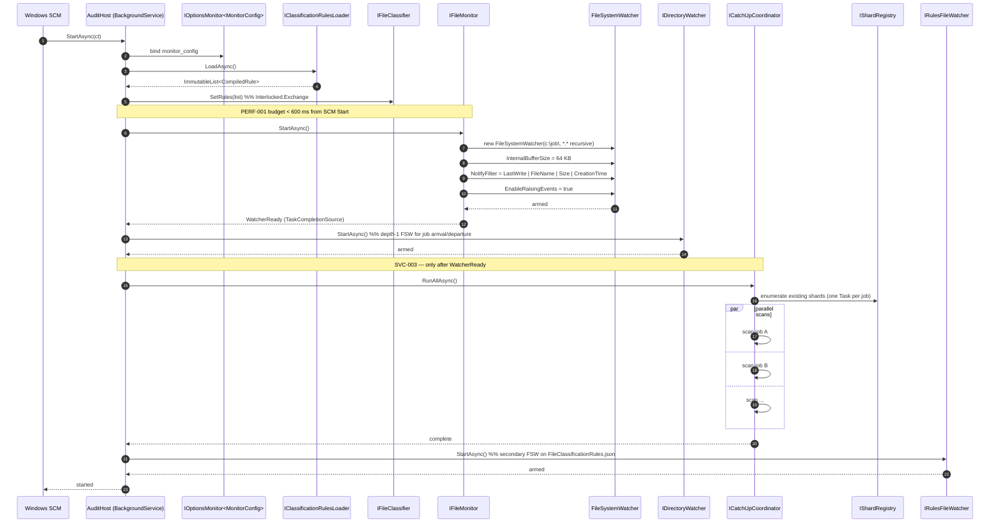

# FalconAuditService — Sequence Diagrams

| Field | Value |
|---|---|
| Document | sequence-diagrams.md |
| Phase | 2 — Sequence diagrams |
| Source | `architecture-design.md` (Alt C, multi-hosted), `schema-design.md`, `api-design.md` |
| Target | Mermaid sequence diagrams for the five canonical flows |
| Date | 2026-04-25 |

---

## 1. Flow Index

| # | Flow | Why it matters |
|---|---|---|
| 1 | Service startup (worker process) | Encodes the SVC-003 contract: FSW armed before catch-up. Validates PERF-001 (< 600 ms). |
| 2 | Job arrival | Manifest creation, shard creation, scoped catch-up scan; per-job `SemaphoreSlim` provisioning. |
| 3 | Single P1 file modification | The hottest path; validates PERF-002 (< 1 s) and the per-priority storage matrix. |
| 4 | Rules hot-reload | Validates PERF-003 (< 2 s); shows atomic `Interlocked.Exchange` semantics. |
| 5 | API event-list query | Validates PERF-005 (< 200 ms); shows two-process boundary, read-only connection, `EventQueryBuilder` reuse. |

All diagrams are Mermaid `sequenceDiagram` syntax. Text annotations call out timing budgets and requirement IDs in the margin.

---

## 2. Flow 1 — Service Startup (Worker Process)



**Timing notes**

- Steps 1–8 (Mon armed): ≤ 600 ms cold (PERF-001).
- Catch-up (step 12) yields if the per-shard channel depth exceeds 50 (CUS-005).
- If `Rules.LoadAsync` throws on malformed JSON, the host fails fast and SCM marks the service `Stopped` with the JSON parse error written to the Windows Event Log. The previous good rules file is **not** in scope here because this is initial startup — there is nothing to fall back to.

---

## 3. Flow 2 — Job Arrival

```mermaid
sequenceDiagram
    autonumber
    participant FSW as FileSystemWatcher (depth 1)
    participant Dir as IDirectoryWatcher
    participant Life as IJobLifecycle
    participant Mft as IManifestManager
    participant Reg as IShardRegistry
    participant Mig as ISchemaMigrator
    participant Repo as ISqliteRepository (ReadWrite)
    participant Cup as ICatchUpCoordinator
    participant Scn as ICatchUpScanner

    FSW->>Dir: Created event "c:\job\WaferLot-A\"
    Dir->>Life: OnArrivalAsync("WaferLot-A")

    Life->>Mft: RecordArrivalAsync("WaferLot-A", machineName, now)
    Mft->>Mft: ensure c:\job\WaferLot-A\.audit\ exists
    Mft->>Mft: read manifest.json (if any) or build fresh
    Mft->>Mft: write tmp file -> File.Move(tmp, dest, overwrite:true)
    Mft-->>Life: ok (atomic)

    Life->>Reg: GetOrCreateAsync("WaferLot-A")
    Reg->>Repo: open audit.db (Mode=ReadWriteCreate)
    Repo->>Repo: PRAGMA journal_mode=WAL; synchronous=NORMAL; ...
    Reg->>Mig: EnsureSchema(repo)
    Mig->>Repo: BEGIN IMMEDIATE; (V1 DDL); PRAGMA user_version=1; COMMIT
    Mig-->>Reg: ok
    Reg->>Reg: create Channel<ClassifiedEvent>(1024)
    Reg->>Reg: create SemaphoreSlim(1) and writer Task
    Reg-->>Life: ShardHandle

    Life->>Cup: ScheduleAsync("WaferLot-A")
    Cup->>Scn: new CatchUpScanner(shardHandle, classifier)
    Cup->>Scn: RunAsync()
    Scn->>Scn: enumerate files vs file_baselines
    loop per file
        alt missing baseline
            Scn->>Reg: route Created event
        else hash differs
            Scn->>Reg: route Modified event
        else baseline exists, file gone
            Scn->>Reg: route Deleted event
        end
        opt channel depth > 50
            Scn->>Scn: await Task.Yield()  %% CUS-005
        end
    end
    Scn-->>Cup: complete

    Life-->>Dir: handled
```

**Timing notes**

- Manifest write must be atomic (MFT-005). `File.Move(overwrite: true)` on NTFS is atomic at the directory entry level.
- Concurrent arrival of the same job (rare race) is resolved by `ConcurrentDictionary.GetOrAdd` inside `Reg`; only one writer Task is ever created per name.
- `EnsureSchema` runs exactly once per shard. On repeated arrivals (e.g. delete + recreate) the existing handle is reused unless the prior departure already disposed it.

---

## 4. Flow 3 — Single P1 File Modification

```mermaid
sequenceDiagram
    autonumber
    participant OS as OS (file write)
    participant FSW as FileSystemWatcher
    participant Mon as IFileMonitor
    participant Deb as IEventDebouncer
    participant Cls as IFileClassifier
    participant Reg as IShardRegistry
    participant Ch as Channel<ClassifiedEvent>
    participant Wri as Per-shard writer Task
    participant Sem as SemaphoreSlim(1)
    participant Rec as IEventRecorder
    participant Hash as IHashService
    participant Diff as IDiffBuilder
    participant Repo as ISqliteRepository (ReadWrite)

    OS->>FSW: write to c:\job\WaferLot-A\Recipes\foo.xml
    FSW->>Mon: Changed event
    Mon->>Deb: Schedule(fullPath)
    Deb->>Deb: cancel prior CTS for path; create new CTS
    Deb->>Deb: Task.Delay(500 ms, cts.Token)

    Note over Deb: 500 ms quiet window (MON-002)

    Deb->>Mon: BuildRawFsEvent(path)
    Mon->>Cls: Classify(path)
    Cls->>Cls: read ImmutableList<CompiledRule> reference
    Cls-->>Mon: ClassifiedEvent { module="Recipes", owner="RecipeService", priority=P1 }

    Mon->>Reg: RouteAsync(classifiedEvent)
    Reg->>Ch: WriteAsync(event)  %% per-shard channel

    Wri->>Ch: ReadAsync()
    Wri->>Sem: WaitAsync()  %% STR-005

    Note over Wri,Repo: PERF-002 budget < 1 s from debounce fire
    Wri->>Rec: RecordAsync(classifiedEvent)
    Rec->>Hash: ComputeAsync(path)
    Hash-->>Rec: sha256 (3x retry x 100 ms on IOException)

    Rec->>Repo: SELECT last_hash FROM file_baselines WHERE filepath=@p
    alt P1 and prior baseline exists
        Rec->>Repo: SELECT old_content FROM audit_log WHERE filepath=@p ORDER BY id DESC LIMIT 1
        Repo-->>Rec: prior content (or new file content if first event)
        Rec->>Diff: Build(priorContent, newContent)
        Diff-->>Rec: unifiedDiffText
    end
    Rec->>Rec: read newContent fully (P1 only)

    Rec->>Repo: INSERT INTO audit_log (... old_content=newContent, diff_text=unifiedDiff ...)
    Rec->>Repo: UPSERT INTO file_baselines (filepath, last_hash=newHash, last_seen=now)
    Repo-->>Rec: ok

    Rec-->>Wri: done
    Wri->>Sem: Release()
    Wri->>Wri: loop ReadAsync next event
```

**Timing notes**

- The 500 ms debounce (MON-002) is the dominant component of end-to-end latency. PERF-002 is measured from debounce fire (step 6).
- Hash + diff on a 1 MB file: ~30 ms.
- SQLite WAL insert: ~5 ms.
- Total post-debounce: ~50 ms (P1) or ~10 ms (P2/P3 fast path with no diff/content read).
- For P2/P3 the steps that read prior content and build a diff are skipped; `old_content` and `diff_text` are bound `NULL`.
- For P4 the recorder logs `Warning("file ignored", path)` and returns without acquiring the semaphore.

**Failure handling**

- `IOException` on hash → 3 × 100 ms back-off; on persistent failure, drop the event and **do not** advance `file_baselines` so the next debounce or catch-up retries.
- `SqliteException` on insert → retry once; persistent failure raises `Error` log and skips `file_baselines` update.

---

## 5. Flow 4 — Rules Hot-Reload

```mermaid
sequenceDiagram
    autonumber
    participant Editor as Operator (edit JSON)
    participant FSW2 as RulesFileWatcher (FSW)
    participant RW as IRulesFileWatcher
    participant Loader as IClassificationRulesLoader
    participant Cls as IFileClassifier
    participant InEvent as in-flight ClassifiedEvent (any thread)

    Editor->>FSW2: save FileClassificationRules.json
    FSW2->>RW: Changed event
    RW->>RW: debounce 200 ms (avoid double-save)

    Note over RW,Loader: PERF-003 budget < 2 s from save
    RW->>Loader: LoadAsync(path)

    alt valid JSON
        Loader->>Loader: parse JSON
        Loader->>Loader: compile globs to Regex (eager)
        Loader-->>RW: ImmutableList<CompiledRule> newList
        RW->>Cls: SetRules(newList)
        Cls->>Cls: Interlocked.Exchange(ref _rules, newList)
        Note right of Cls: subsequent classifications<br/>use newList
    else invalid JSON
        Loader-->>RW: ParseException
        RW->>RW: log Warning("rules reload failed; keeping previous")
        Note right of Cls: existing _rules unchanged
    end

    par concurrent classification
        InEvent->>Cls: Classify(path)
        Cls->>Cls: read _rules reference (atomic)
        Cls-->>InEvent: ClassifiedEvent
    end
```

**Timing notes**

- The 200 ms debounce in `RulesFileWatcher` prevents two reloads when an editor saves twice in quick succession (common with Notepad-style "save = delete+create").
- `Interlocked.Exchange` on a reference type is atomic; readers either see the old or new list, never a torn list. This is why the rules collection is `ImmutableList<CompiledRule>`.
- Worst-case 2 s budget breakdown: 200 ms debounce + 100 ms file read + 50 ms parse + ~50 ms regex compile (typical 20–50 rules) = ~400 ms. Headroom is generous.
- Invalid JSON path: parse fails, exception logged, no swap happens, classifier keeps using prior rules. Next save retries — no manual recovery needed.

---

## 6. Flow 5 — API Event-List Query (Cross-Process)

```mermaid
sequenceDiagram
    autonumber
    participant Client as HTTP Client (analyst)
    participant Kestrel as Kestrel (FalconAuditQuery process)
    participant Ctrl as QueryController
    participant Vdr as EventQueryFilterValidator
    participant Disc as IJobDiscoveryService
    participant Fac as IShardReaderFactory
    participant Conn as SqliteConnection (Mode=ReadOnly)
    participant Bld as IEventQueryBuilder
    participant DB as audit.db (WAL)

    Client->>Kestrel: GET /api/jobs/WaferLot-A/events?priority=P1&page=1&pageSize=50
    Kestrel->>Ctrl: Events("WaferLot-A", filter)
    Ctrl->>Vdr: Validate(filter)
    Vdr-->>Ctrl: ok

    Ctrl->>Disc: ResolveShardPath("WaferLot-A")
    alt found
        Disc-->>Ctrl: c:\job\WaferLot-A\.audit\audit.db
    else not in snapshot
        Disc->>Disc: RefreshAsync()  %% force re-scan
        Disc-->>Ctrl: path or null
    end
    opt path null
        Ctrl-->>Kestrel: 404 Problem(json: job-not-found)
        Kestrel-->>Client: 404
    end

    Ctrl->>Fac: OpenAsync(jobName)
    Fac->>Conn: new SqliteConnection(Mode=ReadOnly;Cache=Shared)
    Fac->>Conn: OpenAsync()
    Fac->>Conn: PRAGMA synchronous=NORMAL; cache_size=-8000; busy_timeout=5000
    Fac-->>Ctrl: ShardReader

    Ctrl->>Bld: Build(filter)
    Bld-->>Ctrl: (whereSql, parameters)

    Note over Ctrl,DB: PERF-005 budget < 200 ms

    Ctrl->>Conn: BEGIN DEFERRED  %% snapshot consistency for count + page
    Ctrl->>DB: SELECT COUNT(1) FROM audit_log WHERE <whereSql>
    DB-->>Ctrl: 18342
    Ctrl->>DB: SELECT id, changed_at, ... FROM audit_log WHERE <whereSql> ORDER BY changed_at DESC, id DESC LIMIT 50 OFFSET 0
    DB-->>Ctrl: 50 rows
    Ctrl->>Conn: COMMIT  %% release snapshot

    Ctrl->>Ctrl: map rows -> EventListItemDto[]
    Ctrl->>Ctrl: set X-Total-Count: 18342, X-Page: 1, X-PageSize: 50, Cache-Control: no-store

    Ctrl-->>Kestrel: 200 OK + body
    Kestrel-->>Client: 200 OK
    Conn->>Conn: DisposeAsync()  %% scope ends
```

**Timing notes**

- Both queries run on the same connection in a deferred transaction so `COUNT` and the page see the same snapshot — important when writes are concurrent.
- `COUNT(1)` and the page query both use `ix_audit_module_priority` for a `priority=P1` filter (or the appropriate compound index for other filter combinations).
- The query process **never holds a write lock**; the worker's `SemaphoreSlim(1)` is unaffected by reader load. WAL mode (REL-004) is what enables this isolation.
- Cross-process latency: the query process opens a fresh `Mode=ReadOnly` handle to the WAL-mode shard. There is no IPC to the worker; the OS file system is the integration point.
- 404-then-refresh is bounded: `JobDiscoveryService.RefreshAsync` enumerates `c:\job\*\.audit\audit.db` (typically < 50 ms for ~10 jobs).

---

## 7. Cross-Cutting Notes

### 7.1 Cancellation propagation

All async operations accept a `CancellationToken` rooted at:

- `BackgroundService.StoppingToken` (worker startup, classifier reload, catch-up).
- `HttpContext.RequestAborted` (query process).

A clean `OperationCanceledException` is logged at `Information`, never `Error`.

### 7.2 Thread ownership

| Thread / pool | Owners |
|---|---|
| FSW callback threads | `FileMonitor`, `DirectoryWatcher`, `RulesFileWatcher` (all hand off quickly) |
| ThreadPool | `EventDebouncer` `Task.Delay`, per-shard writer Task, catch-up Tasks |
| Kestrel thread pool | API request handlers (query process only) |
| SCM service threads | `StartAsync` / `StopAsync` of both processes |

The per-shard writer Task is the only place SQLite writes happen; reads happen on whichever Kestrel pool thread serves the request (query process), with `SqliteConnection` instances strictly per-request.

### 7.3 Cross-process consistency

- WAL mode allows readers and the writer to coexist without locking each other (REL-004).
- The query process never holds a write lock. The worker's `SemaphoreSlim(1)` is internal; the query process is unaware of it.
- `JobDiscoveryService` polls every 30 s; force-refresh on 404 covers the gap (Flow 5).
- Manifest reads in the query process retry once on `IOException` to handle the writer's `File.Move` rename window (~ms).

---

## 8. Summary

The five sequence diagrams above capture every load-bearing interaction in FalconAuditService:

1. **Startup** proves the SVC-003 ordering and sets the PERF-001 boundary.
2. **Job arrival** shows manifest, shard, and catch-up provisioning in one transactional flow.
3. **P1 modification** is the hot path that drives PERF-002 and the per-priority storage matrix.
4. **Rules hot-reload** demonstrates atomic configuration change without dropping in-flight events.
5. **API query** ties the two processes together and shows how PERF-005 is achieved with read-only connections, indexed predicates, and deferred-snapshot count + page on the same connection.

These diagrams form the contract that `code-scaffolding.md` implements and `test-plan.md` exercises.
